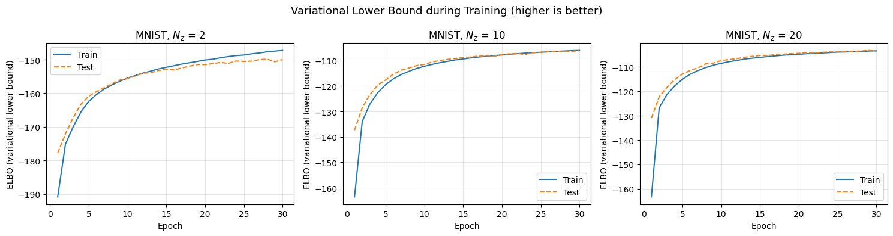
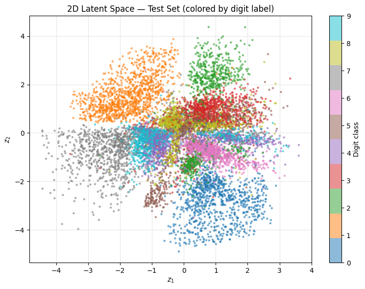
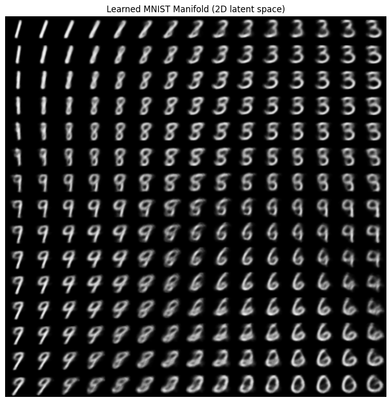
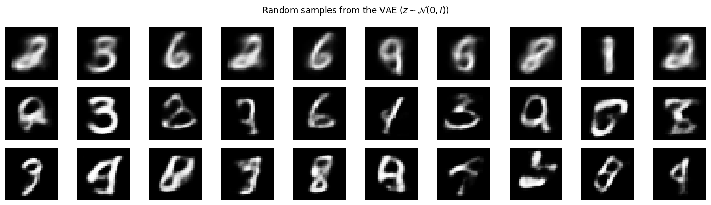

# Reproduction of Auto-Encoding Variational Bayes 

Reproduction of the main results from:

> Kingma, D. P., & Welling, M. (2014). **Auto-Encoding Variational Bayes**. *ICLR 2014*. [arXiv:1312.6114](https://arxiv.org/abs/1312.6114)

Assignment for *Advanced Statistical Inference* - EURECOM 2026  
**Authors:** Clément Marrière · Dimitri Gardarin

---

## Results

### Variational Lower Bound (ELBO) during training


### 2D Latent Space


### Learned 2D Manifold


### Random Samples (z ~ N(0, I))


---

## Reproduced experiments

| Experiment | Paper reference |
|---|---|
| ELBO curves for Nz ∈ {2, 10, 20} | Figure 2 |
| 2D latent space scatter (coloured by digit) | Figure 4 |
| 2D manifold via inverse Gaussian CDF | Figure 4b |
| Random samples from the generative model | Figure 5 |
| Reconstructions | — |

**Final ELBO values:**

| Nz | Train ELBO | Test ELBO |
|---|---|---|
| 2  | −147.27 | −149.95 |
| 10 | −106.00 | −106.14 |
| 20 | −103.37 | −103.43 |

---

## Repository structure

```
├── vae_assignment_results.ipynb   # Main notebook (model, training, all figures)
├── elbo_curves.png
├── latent_space_2d.png
├── latent_manifold_2d.png
└── generated_samples.png
```

## Setup

```bash
pip install torch torchvision matplotlib scipy tqdm
jupyter notebook vae_assignment_results.ipynb
```

## Architecture

- **Encoder** q_φ(z|x): MLP (784 → 400 tanh → μ, log σ²)
- **Decoder** p_θ(x|z): MLP (Nz → 400 tanh → 784 sigmoid)
- **Loss**: negative ELBO = BCE reconstruction + analytical KL divergence
- **Optimizer**: Adam (lr = 1e-3), batch size 128, 30 epochs
